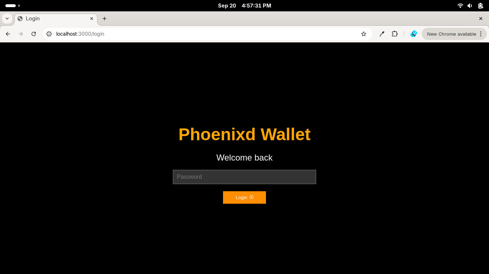

<p align="center">




</p>


# Phoenixd Lightning Wallet UI (StartOS)

This project is a Lightning wallet interface built on top of [Phoenixd server](https://phoenix.acinq.co/server/) designed for [Start9 server](https://start9.com/). It allows you to easily manage your phoenixd transactions and leverage the power of Phoenixd for your Bitcoin Lightning wallet needs.

This repository creates the `s9pk` package that is installed to run `phoenixd-lightning-wallet-ui` on [StartOS](https://github.com/Start9Labs/start-os/). Learn more about service packaging in the [Developer Docs](https://start9.com/latest/developer-docs/).


## Installing (on StartOS)

### 1. Install as a sideload serivice
1. Download phoenixd-lightning-wallet-ui.s9pk on your Start9os server [link] (https://github.com/hkarani/phoenixd-lightning-wallet-ui-startos/releases/download/v0.1.1/phoenixd-lightning-wallet-ui.s9pk)

2. Go **System > Sideload a Service**
<p align="center">

</p>

3. Browse to upload phoenixd-lightning-wallet-ui.s9pk and install
<p align="center">

</p>

### 2. Installing via cli

Run the following commands to determine successful install:
> :information_source: Change server-name.local to your Start9 server address

```
start-cli auth login
# Enter your StartOS password
start-cli --host https://server-name.local package install phoenixd-lightning-wallet-ui.s9pk
```

If you already have your `start-cli` config file setup with a default `host`, you can install simply by running:

```
make install
```

> **Tip:** You can also install the phoenixd-lightning-wallet-ui.s9pk using **Sideload Service** under the **System > Manage** section.

### Verify Install

Go to your StartOS Services page, select **Phoenixd lightning wallet UI**, configure and start the service. Then, verify its interfaces are accessible.

**Done!** 

## Features

- [x] ~~Send and receive bitcoin with Bolt11 invoices~~
- [x] ~~Pay offer and receive bitcoin with BOLT12 offers~~
- [x] ~~Paginated transactions history table~~
- [x] ~~Pay wallet contacts~~
- [x] ~~Contacts address book~~
- [x] ~~Password login~~
- [x] ~~Import Wallet offer with QR Scan~~
- [x] ~~Scan QR to pay BOLT11 invoices~~
- [x] ~~Show bitcoin value in USD~~
- [x] ~~Wallet seed backup confirmation before setting password~~
- [ ] Wallet notifications
- [ ] Create multiple wallets
- [ ] Recieve bitcoin with mainnet address
- [ ] Import wallet contacts
- [ ] Show sats amount in USD on transction table
- [ ] Add your BTC price fetching api
- [ ] Choose default currency
## Build it Yourself

### Dependencies

Install the system dependencies below to build this project by following the instructions in the provided links. You can find instructions on how to set up the appropriate build environment in the [Developer Docs](https://docs.start9.com/latest/developer-docs/packaging).

- [docker](https://docs.docker.com/get-docker)
- [docker-buildx](https://docs.docker.com/buildx/working-with-buildx/)
- [yq](https://mikefarah.gitbook.io/yq)
- [deno](https://deno.land/)
- [make](https://www.gnu.org/software/make/)
- [start-sdk](https://github.com/Start9Labs/start-os/tree/sdk/)

### Build s9pk file

Prepare your StartOS build environment. In this example we are using Ubuntu 20.04.
1. Install docker
```
curl -fsSL https://get.docker.com | bash
sudo usermod -aG docker "$USER"
exec sudo su -l $USER
```
2. Set buildx as the default builder
```
docker buildx install
docker buildx create --use
```
3. Enable cross-arch emulated builds in docker
```
docker run --privileged --rm linuxkit/binfmt:v0.8
```
4. Install yq
```
sudo snap install yq
```
5. Install deno
```
sudo snap install deno
```
6. Install essentials build packages
```
sudo apt-get install -y build-essential openssl libssl-dev libc6-dev clang libclang-dev ca-certificates
```
7. Install Rust
```
curl https://sh.rustup.rs -sSf | sh
# Choose nr 1 (default install)
source $HOME/.cargo/env
```
8. Build and install start-sdk 
```
git clone https://github.com/Start9Labs/start-os.git && \
 cd start-os && git submodule update --init --recursive && \
 make sdk
```
Initialize sdk & verify install
```
start-sdk init
start-sdk --version
```
Now you are ready to build the `phoenixd-lightning-wallet-ui` package!

## Cloning

Clone the project locally:

```
git clone https://github.com/hkarani/phoenixd-lightning-wallet-ui-startos.git
cd phoenixd-lightning-wallet-ui
git submodule update --init --recursive
```

## Building

To build the `phoenixd-lightning-wallet-ui` package for all platforms using start-sdk, run the following command:

```
make
```

To build the `phoenixd-lightning-wallet-ui` package for a single platform using start-sdk, run:

```
# for amd64
make x86
```
or
```
# for arm64
make arm
```

